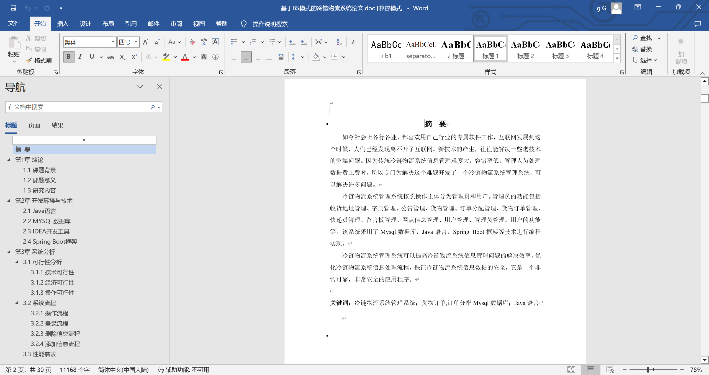
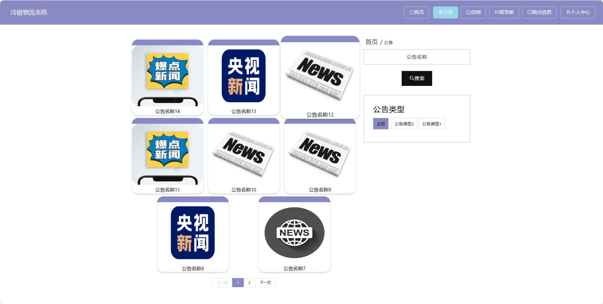
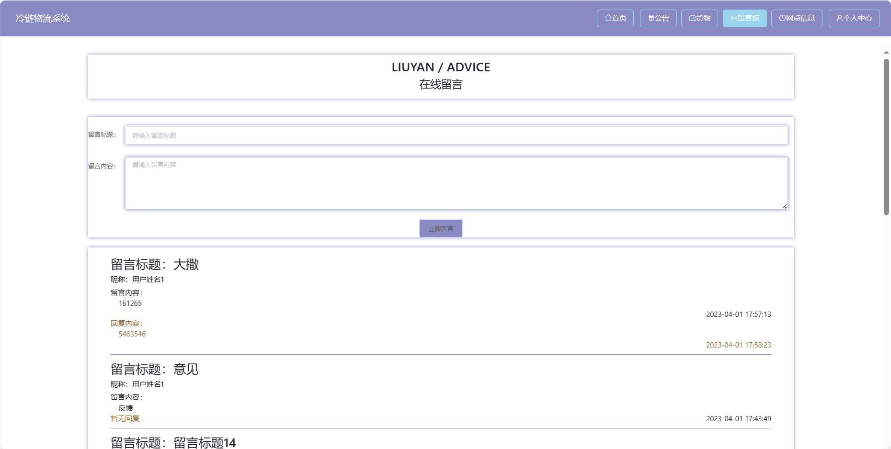
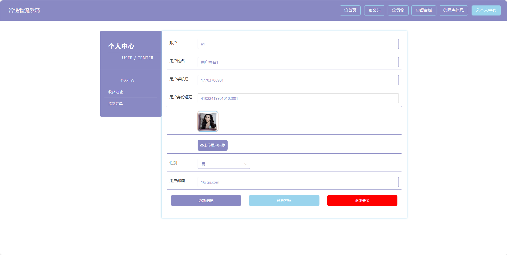

## 基于SpringBoot的冷链物流系统(程序+报告)

###  获取sql数据库文件: 从戎源码网 (https://armycodes.com/) QQ: 386869957 QQ群: 377586148
###  所有系统地址: (https://github.com/YuLin-Coder/AllProjectCatalog) 
###  所有项目以及源代码本人均调试运行无问题 可支持远程安装部署调试、定制修改、代码讲解

## 项目介绍
基于SpringBoot的冷链物流系统，系统包含三种角色：管理员、用户,快递员,系统分为前台和后台两大模块，主要功能如下。

### 【管理员】:
1. 首页：提供管理员进入后台管理的入口。
2. 个人中心：管理员可以管理个人信息。
3. 管理员管理：添加、编辑、删除系统管理员账号。
4. 快递员管理：管理快递员信息。
5. 用户管理：查看、编辑、冻结或删除用户账号。
6. 公告管理：发布、编辑、删除系统公告。
7. 货物管理：查看、编辑、删除货物信息。
8. 订单分配管理：进行订单的分配和调度。
9. 留言板管理：查看用户在留言板上的反馈。
10. 网点信息管理：维护物流网点的信息。
11. 基础数据管理：管理系统的基础数据。
12. 轮播图信息：管理员可以设置首页轮播图。

### 【快递员】:
1. 首页：提供快递员进入后台管理的入口。
2. 个人中心：快递员可以管理个人信息。
3. 公告管理：查看系统发布的公告。
4. 订单分配管理：查看待配送的订单。
5. 留言板管理：查看用户在留言板上的反馈。
6. 网点信息管理：查看所属网点的信息。

### 【前台】:
1. 首页：提供用户进入系统的入口。
2. 公告：用户可以查看系统发布的公告。
3. 货物：用户可以查询货物的实时状态、位置等信息。
4. 留言板：用户可以在留言板上留下对物流服务的意见和建议。
5. 网点信息：提供用户查询物流网点的信息，包括地址、联系方式等。
6. 个人中心：用户可以管理个人信息，查看订单历史、收藏等。

## 项目技术
- 编程语言：Java
- 数据库：MySQL
- 项目管理工具：Maven
- 前端技术：HTML、CSS、JavaScript、Jquery、Vue
- 后端技术：Spring、SpringMVC、MyBatis

## 运行环境
- JDK版本：JDK1.8及以上
- 开发工具：IDEA、Ecplise、Myecplise都可以
- 数据库: MySQL5.7及以上
- Maven：maven3.0及以上
- Node：14.14.0及以上

## 运行截图

